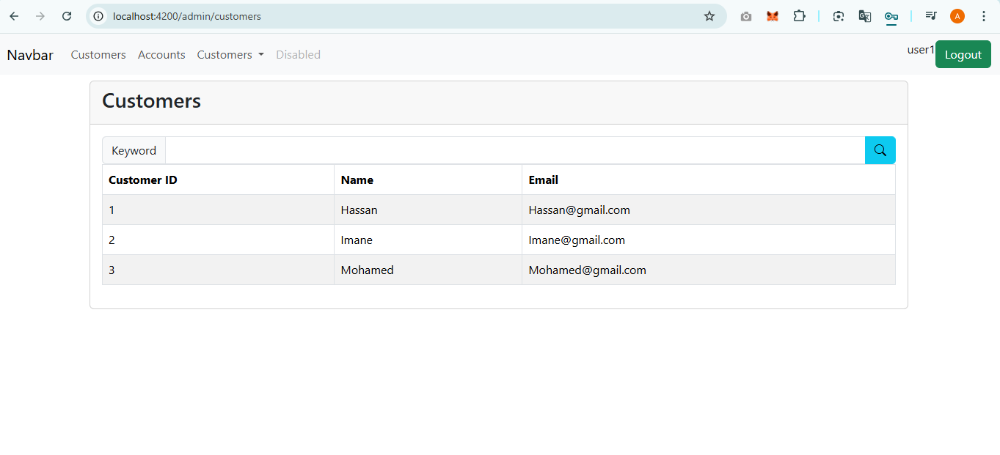

# Rapport du Projet E-Banking Frontend

## Description du Projet
Ce projet est une application frontend pour un système de banque électronique développé avec Angular. Il fournit une interface utilisateur pour interagir avec les API du backend et gérer les comptes bancaires, les clients et les opérations bancaires.

## Architecture
L'application est structurée selon l'architecture Angular:
- **Composants**: Éléments d'interface utilisateur réutilisables
- **Services**: Gestion des appels API et logique métier
- **Modèles**: Définition des structures de données
- **Routes**: Configuration de la navigation entre les pages

## Fonctionnalités
- Authentification des utilisateurs
- Gestion des clients (liste, ajout, modification, suppression)
- Consultation des comptes bancaires
- Réalisation d'opérations bancaires (dépôt, retrait, virement)
- Consultation des historiques des opérations

## Pages principales

### Page de Connexion
Cette page permet aux utilisateurs de s'authentifier pour accéder à l'application.


### Liste des Clients
Cette page affiche la liste de tous les clients avec des options pour gérer chaque client.


### Modifier un Client && afficher les comptes d'un client
Cette page permet de modifier les informations d'un client et d'afficher ses comptes bancaires associés.


### Home
Cette page montre la premiere page apres avoir authentifié


### Comptes Bancaires pour Admin
Cette page affiche les informations sur les comptes bancaires et permet d'effectuer des opérations.


### Ajout d'un nouveau client


### Comptes Bancaires User
Cette page affiche les informations sur les comptes bancaires et cacher la partie operation sur un utilisateur normal.


### Un client ne peut que consulter



## Technologies Utilisées
- Angular 17
- TypeScript
- RxJS pour la gestion des flux asynchrones
- JWT pour l'authentification
- Bootstrap pour le style et la mise en page responsive

## Problèmes connus et solutions
- **Problème d'authentification**: L'API backend renvoie un token avec la clé `access-token` tandis que le frontend attend `access_token`. Une correction a été implémentée dans le service d'authentification pour gérer cette différence.

## Structure du Projet
```
digital-banking-web/
├── src/
│   ├── app/
│   │   ├── services/         # Services pour les appels API
│   │   ├── models/           # Définitions des modèles de données
│   │   ├── login/            # Composant de connexion
│   │   ├── customers/        # Composant de gestion des clients
│   │   ├── accounts/         # Composant de gestion des comptes
│   │   └── ...
│   ├── assets/               # Ressources statiques
│   └── environments/         # Configuration des environnements
└── ...
```

## Comment démarrer
1. Assurez-vous que Node.js et npm sont installés
2. Installez les dépendances avec `npm install`
3. Démarrez le serveur de développement avec `npm start` ou `ng serve`
4. L'application sera accessible à l'adresse `http://localhost:4200`


## Améliorations futures
- Implémentation de la pagination pour les listes de clients et d'opérations
- Ajout de filtres de recherche avancés
- Amélioration de l'interface utilisateur avec des graphiques pour visualiser les transactions
- Support multilingue
